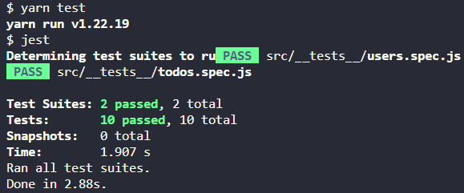
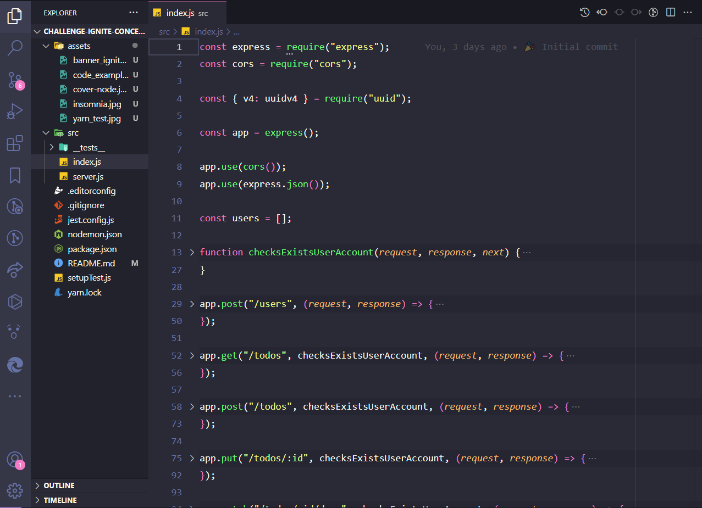
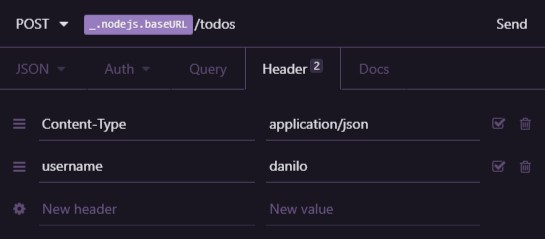

# Ignite Challenge 1 - NodeJS Track


<h3 align="center">
   Challenge 01: Node.js Concepts
</h3>

<p align="center">“Don't wait to plant, just be patient to harvest”!</blockquote>

<p align="center">
  

  

  

  <a href="https://github.com/artur-duart/challenge-ignite-concepts-nodejs/stargazers">
    
  </a>
</p>

<p align="center">
   <a href="#rocket-about-the-challenge">About the challenge</a>&nbsp;&nbsp;&nbsp;|&nbsp;&nbsp;&nbsp;
   <a href="#keyboard-installation-and-execution-of-the-project">Installation and Execution of the Project</a>&nbsp;&nbsp;&nbsp;|&nbsp;&nbsp;&nbsp;
   <a href="#application-template">Application Template</a>&nbsp;&nbsp;&nbsp;|&nbsp;&nbsp;&nbsp;
   <a href="#application-routes-instructions">Application routes</a>&nbsp;&nbsp;&nbsp;|&nbsp;&nbsp;&nbsp;
   <a href="#tests-specification-instructions">Specification of tests</a>&nbsp;&nbsp;&nbsp;|&nbsp;&nbsp;&nbsp;
   <a href="#memo-license">License</a>
</p>

## :rocket: About the challenge

In this challenge, a backend application was created to train what I've learned so far in Node.js!

It is an application to manage tasks (or _todos_). It will be allowed to create a user with `name` and username, as well as to CRUD of _todos_:

- Create a new _todo_;
- List all _todos_;
- Change the `title` and `deadline` of an existing _todo_;
- Mark a _todo_ as done;
- Delete a _todo_;

All this for each specific user (the `username` will be passed through the header).

### :keyboard: Installation and Execution of the Project

- Clone this repository

```
> git clone https://github.com/artur-duart/challenge-ignite-concepts-nodejs
```

- Navigate to the main directory of the project

```
> cd challenge-ignite-concepts-nodejs
```

- Install dependencies with Yarn

```
yarn
```

- Run the test suite

```
yarn test
```

- Run the project

```
yarn dev
```

<p align="center">
   
</p>

### Application template

A template model that has the skeleton of the project was used.

The template can be found at the following url: **[Access Template](https://github.com/rocketseat-education/ignite-template-conceitos-do-nodejs)**

**Tip**: If you don't know how to use Github repositories as a template, use the guide in **[our FAQ](https://www.notion.so/ddd8fcdf2339436a816a0d9e45767664).**

Now navigate to the created folder and open it in Visual Studio Code, remember to run the `yarn` command in your terminal to install all the dependencies, and you will have something like this:

<p align="center">
   
</p>

### Application Routes (Instructions)

Notion documentation about routes and tests: **[API and Test Documentation](https://www.notion.so/Desafio-01-Conceitos-do-Node-js-59ccb235aecd43a6a06bf09a24e7ede8)**

With the template already cloned and the `index.js` file open, you must complete where you don't have code with the code to achieve the objectives of each test.

#### POST `/users`

The route must receive `name`, and `username` inside the request body. When registering a new user, it must be stored inside an object in the following format:

```jsx
{
id: 'uuid', // needs to be a uuid
name: 'Danilo Vieira',
username: 'danilo',
all: []
}
```

Make sure the ID is a UUID, and always start the `todos` list as an empty array.

#### GET `/all`

The route must receive, via the request header, a `username` property containing the user's username and return a list of all tasks for that user.

#### POST `/all`

The route must receive `title` and `deadline` within the request body, and a `username` property containing the user's username within the request header. When creating a new _todo_, it must be stored inside the `todos` list of the user who is creating this task. Each task must be in the following format: . Make sure the ID is a UUID.

```jsx
{
id: 'uuid', // needs to be a uuid
title: 'Task name',
done: false,
deadline: '2021-02-27T00:00:00.000Z',
created_at: '2021-02-22T00:00:00.000Z'
}
```

**Note**: Remember to always set the `done` property to `false` when creating a _todo_.

**Tip**: When making the request with Insomnia or Postman, fill in the `deadline` date with the `YEAR-MONTH-DAY` format and when saving the task by route, do as follows:

```jsx
{
id: 'uuid', // needs to be a uuid
title: 'Task name',
done: false,
deadline: new Date(deadline)
created_at: new Date()
}
```

Using `new Date(deadline)` will transform the string "YEAR-MONTH-DAY" (eg "2021-02-25") to a valid JavaScript date.

#### PUT `/all/:id`

The route must receive, via the request header, a `username` property containing the user's username and receive the `title` and `deadline` properties within the body. It is necessary to change **only** the `title` and `deadline` of the task that has the `id` equal to the `id` present in the route parameters.

#### PATCH `/all/:id/done`

The route must receive, via the request header, a `username` property containing the user's username and change the `done` property to `true` on an _todo_ that have an `id` equal to the `id` present in the route parameters.

#### DELETE `/all/:id`

The route must receive, via the request header, a `username` property containing the user's username and exclude an _todo_ that have an `id` equal to the `id` present in the route parameters.

### Tests Specification (Instructions)

In each test, there is a brief description of what your application must fulfill in order for the test to pass.

If you have doubts about what the tests are and how to interpret them, take a look at **[our FAQ](https://www.notion.so/FAQ-Desafios-ddd8fcdf2339436a816a0d9e45767664)**

For this challenge, we have the following tests:

#### User tests

- **Should be able to create a new user**

For this test to pass, you must allow a user to be created and return a json with the created user. You can see the format of a user [here](https://www.notion.so/Desafio-01-Conceitos-do-Node-js-59ccb235aecd43a6a06bf09a24e7ede8).

It is also required that you return the response with the `201` code.

- **Should not be able to create a new user when username already exists**

For this test to pass, before creating a user you must validate if another user with the same `username` already exists. If it exists, return a response with status `400` and a json in the following format:

```jsx
{
  error: "Error message";
}
```

The message can be of your choice, as long as the property is `error`.

#### Testing _todos_

**Middleware**

To complete all the tests referring to _todos_ it is necessary to have completed the missing code in the `checkExistsUserAccount` middleware first. For that, you should get the user's `username` from the request header, check if that user exists and then put that user inside the `request` before calling the `next` function. If the user is not found, you must return a response containing status `404` and a json in the following format:

```jsx
{
  error: "Error message";
}
```

**Note:** The username must be sent via the header in a property called `username`:



- **Should be able to list all user's todos**

For this test to pass, in the GET route `/todos` it is necessary to get the user that was forwarded to the `request` in the `checkExistsUserAccount` middleware and then return the list `todos` that is in the user object as it was created to satisfy the [first test](<https://www.notion.so/Desafio-01-Conceitos-do-Node-js-59ccb235aecd43a6a06bf09a24e> 7ede8).

- **Should be able to create a new todo**

For this test to pass, in the POST `/todos` route, it is necessary to get the user that was forwarded to the `request` in the `checkExistsUserAccount` middleware, also get the `title` and `deadline` from the request body and add a new _todo_ in the `todos` list that is in the user object.

Remember to follow the standard structure of a _todo_ as shown [here](https://www.notion.so/Desafio-01-Conceitos-do-Node-js-59ccb235aecd43a6a06bf09a24e7ede8).

- **Should be able to update a todo**

For this test to pass, in the PUT route `/todos/:id` it is necessary to update an existing _todo_, receiving the `title` and the `deadline` by the request body and the `id` present in the route parameters.

- **Should not be able to update a non existing todo**

For this test to pass, you must not allow the update of a _todo_ that does not exist and return a response containing a `404` status and a json in the following format:

```jsx
{
  error: "Error message";
}
```

- **Should be able to mark a whole as done**

For this test to pass, in the PATCH `/todos/:id/done` route you must change the `done` property of a _todo_ from `false` to `true`, receiving the `id` present in the route parameters.

- **Should not be able to mark a non existing todo as done**

For this test to pass, you must not allow changing the `done` property of a _todo_ that does not exist and return a response containing a `404` status and a json in the following format:

```jsx
{
  error: "Error message";
}
```

- **Should be able to delete a todo**

For this test to pass, DELETE `/todos/:id` you must allow a _todo_ to be deleted using the `id` passed in the route. The return should only be a `204` status which represents a response with no content.

- **Should not be able to delete a non existing todo**

For this test to pass, you must not allow deleting a _todo_ that does not exist and return a response containing a `404` status and a json in the following format:

```jsx
{
  error: "Error message";
}
```

## :memo: License

This project is licensed under the MIT license. See the [LICENSE](https://github.com/artur-duart/challenge-ignite-concepts-nodejs/blob/main/LICENSE) file for more details.

---

Made with 💜 by <a href="https://www.linkedin.com/in/artur-duart">Artur Duarte</a> :wave:
